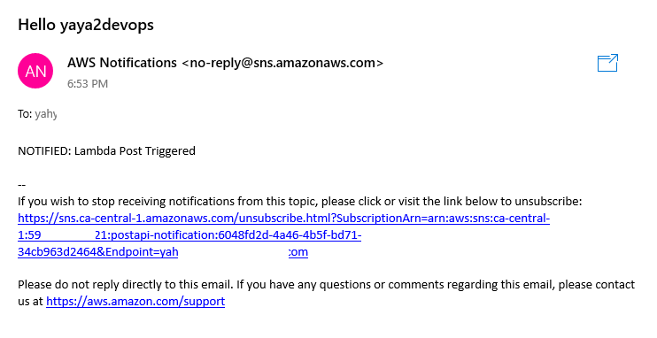

A serverless notification API is a serverless application that uses AWS Lambda and Amazon SNS to send email notifications to subscribers.

- [Setting up Post Notification](#setting-up-post-notification)
- [Create Lambda](#create-lambda)
   - [Granting SNS Access](#granting-sns-access-to-the-lambda-function)
- [Test Post Endpoint](#test-post-endpoint)

As we already mentioned. The API operates by initially generating a Lambda function capable of accepting incoming POST requests containing a specified name and accompanying message. 

Subsequently, this Lambda function triggers the transmission of an SNS message, encompassing both the provided name and message, to an assigned topic. 

It's worth highlighting that the configuration of the SNS topic is optimized for dispatching email notifications to its group of subscribers.


Here is a comprehensive and detailed representation that **I have prepared** for your reference.
* An API receives a POST request with a JSON payload containing a `name` and `message`.
* The Lambda function processes the request and extracts the `name` and `message` from the payload.
```
       API Request (POST)       Lambda Function      SNS Topic             Email Subscribers
      +------------------>   +----------------->  +-------------------->  +-----------------+ 
  H   |                      |                    |                    |  | List of EMAILs; | Y
  E   |    {                 |   {                |   {                |  |                 | A
  L   |   "name": "Yaya",    |   "name": "Yaya",  |   "name": "Yaya",  |  |                 | Y
  L   |   "message": "Hey"   |  "message": "Hey"  |   "message": "Hey" |  |      e.g.       | A
  O   |    }                 |   }                |   }                |  |                 | 2
      |                      |                    |                    |  |   Yaya Email    | D
  T   +<------------------   +<-----------------  +<-----------------  |  |   Yours, etc.   | E
  H   |    HTTP Response     |    Publish SNS     |    Send Email      |  |                 | V
  E   |                      |    Message         |    Notifications   |  |                 | O
  R   |     Status 200       |    with            |    to Subscribers  |  |                 | P
  E   |                      |    name & message  |                    |  |                 | S
      +----------------------+--------------------+--------------------+  +-----------------+ 
```
* The Lambda function publishes an SNS message with the extracted `name` and `message` to a pre-configured SNS topic.
* The SNS topic is configured to send email notifications to its subscribers.
* Email subscribers receive notifications containing the `name` and `message` published by the Lambda function.

### Setting up Post Notification

1. Create a new SNS topic and subscribe to it using the following aws command:
```bash
aws sns create-topic --name <topic-name>
```
After creating the topic, copy the SNS Topic `Amazon Resource Name` or ARN for later use e.g. output:
```bash
{
    "TopicArn": "arn:aws:sns:<region>:<aws-id>:<topic-name>"
}
```
2. Subscribe to the newly created SNS topic using the aws command below. Replace `<region>` with your `AWS region`, `<account-id>` with your AWS account ID, and `<email>` with the email address you want to use for receiving notifications:

```bash
aws sns subscribe \
--topic-arn arn:aws:sns:<region>:<account-id>:<topic-name> \
--protocol email \
--notification-endpoint <email>
```

- Confirm your subscription to the topic.


### Create Lambda

1. Create a Lambda function with Python `3.9` runtime.
2. Enable the function URL in the Lambda function configuration 
3. Check box none to auth or [leave both steps for later.](#assign-url-for-lambda)
3. Add the following code to your lambda

```py
import json
import boto3

def lambda_handler(event, context):
    
    client = boto3.client('sns')
    snsArn = 'arn:aws:sns:<REGION>:<ACCOUNT ID>:<topic-name>'
    
    body = json.loads(event.get("body"))
    
    
    response = client.publish(
        TopicArn = snsArn,
        Message = body.get("message"),
        Subject= f"Hello {body['name']}"
    )
    
    return {
      'statusCode': 200,
      'body': json.dumps(response)
   }
```
- Assign the sns arn.
- Deploy the Lambda function.

### **Granting SNS Access to the Lambda Function**

You need to enable SNS access to the Lambda function,

1. Go to the Lambda Function in the AWS Management Console.
2. Click on the **Configuration** tab.
3. In the **Permissions** section, click on the link for the Role name associated with the Lambda function.
4. Under **Permissions**, click on **Add Permission**.
5. Now, choose **Attach Policies** to proceed.
6. Filter the policy list and search for **AmazonSNSFullAccess**.
7. Select **AmazonSNSFullAccess** and attach it to the Lambda function's role.


### Assign URL for Lambda
You have to generate an URL to make use of in our post request.

1. Open the `configuration pane`.
2. In the left pane, navigate to the `function URL` section.
3. Generate a new URL and select the `No Authorization` option (`Auth Type; NONE`).
4. observe the policy sattements you have just made.
```JSON
{
  "Version": "2012-10-17",
  "Statement": [
    {
      "StatementId": "FunctionURLAllowPublicAccess",
      "Effect": "Allow",
      "Principal": "*",
      "Action": "lambda:InvokeFunctionUrl",
      "Resource": "arn:aws:lambda:<region>:<aws-id>:function:postapi",
      "Condition": {
        "StringEquals": {
          "lambda:FunctionUrlAuthType": "NONE"
        }
      }
    }
  ]
}
```
5. Verify the modifications if you haven't performed the aforementioned actions during the initial setup.

### Test Post Endpoint

1. Open Thunder Client. You can install its extension from vs code or any other **API testing tool**.

Next,  you have to send a post request to the Lambda function URL with a name and message.

2. Use the following curl command to send a POST request to the Lambda function URL. 
```bash
curl --request POST \
  --url     'https://yours.lambda-url.<region>.on.aws/' \
  --header 'Content-Type: application/json' \
  --data '{"name": "yaya2devops", "message": "NOTIFIED: Lambda Post Triggered"}'
```
Replace `https://yours.lambda-url.<region>.on.aws/` with the actual Lambda function URL.

3. Check that your API tool is correctly returning a status code of 200 OK upon successful operations.


- Finally, check your subscribed email for the post notif.



### Conclude

By carefully following the outlined steps, you'll be well-equipped to establish a robust and functional serverless notification API using AWS Lambda and Amazon SNS.

Your thorough understanding of this process will serve as a great deal going forward (Remmember that!)<br> Since you've made it this far, allow me to [design a path for you.](https://developer.twitter.com/en/docs/twitter-api/getting-started/make-your-first-request)
